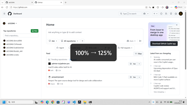

# ScaleSwitcher

[English](./README.md)

ScaleSwitcher は、WPF と .NET 10 で作成された、タスクトレイ常駐型の軽量な Windows ディスプレイ設定切り替えツールです。複数のモニターに対して、拡大/縮小率（DPI）や画面解像度をすばやく変更できます。



## 主な機能

- **左クリックで拡大/縮小率をローテーション**: タスクトレイアイコンを左クリックするだけで、あらかじめ指定した特定の拡大率（例：100% → 150% → 100%）にすばやく切り替えます。
- **右クリックメニュー（多言語対応）**:
  - マルチモニターに対応し、モニターごとに解像度や拡大率のサブメニューが動的に生成されます。
  - 「Windows起動時に実行」メニューのON/OFFで、PC起動時にアプリが自動起動するように設定できます。
- **設定画面**:
  - 左クリックで拡大率を切り替える対象のディスプレイを選択できます。
  - ローテーションに含める拡大/縮小率（％）をチェックボックスでカスタマイズできます。
- **多言語対応**: 日本語OS環境では日本語表記になり、それ以外の環境では英語表記になります。
- **DPI Aware（DPI対応）**: ネイティブの DPI Awareness (`PerMonitorV2`) に対応しているため、現在の画面スケール設定を正確に検知・反映します。

## 動作環境

- Windows 11
- .NET 10.0 ランタイム (WPF対応)

## インストール・ビルド・実行方法

プロジェクトファイルをローカル環境にコピーし、dotnet CLI を使用して実行またはビルドします。

### アプリケーションの実行
```bash
dotnet run
```

### プロジェクトのビルド
```bash
dotnet build
```

### リリースビルドの作成
```bash
dotnet build -c Release
```

ビルドされた実行ファイル（`.exe`）は、以下のディレクトリに出力されます：
`bin/Release/net10.0-windows/ScaleSwitcher.exe`

## 設定ファイルの保存先

ユーザーの設定情報は JSON 形式で以下のパスに保存されます：
```
%LOCALAPPDATA%\ScaleSwitcher\settings.json
```

## 技術情報

- C# / WPF (.NET 10)
- Win32 APIによる制御 (`user32.dll`, `shcore.dll` の P/Invoke)
- ネイティブの Windows DPI Awareness 設定 (`app.manifest` を使用)
- Windows Forms の `NotifyIcon` をラップして使用（サードパーティライブラリ不使用）
